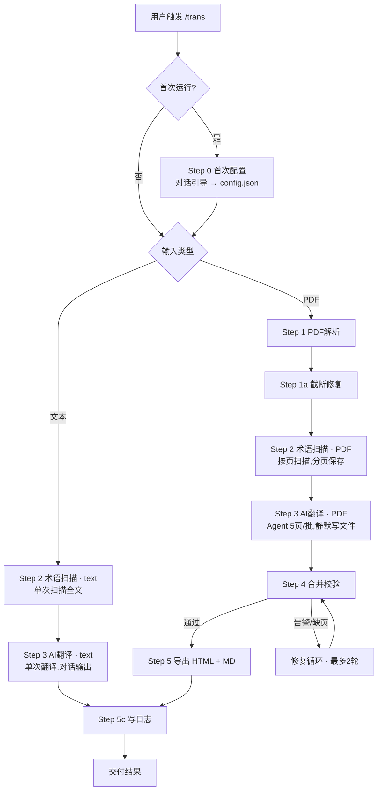

# Gxpcode-translator

专业翻译工具。用术语词典（CSV）+ AC 自动机 + OCR + LLM 完成文本/PDF 翻译，PDF 输出双语对照 HTML + Markdown。

触发方式：`/trans` 指令或自然语言（"翻译这段话"）。

---

## 首次配置

> 触发条件：`config.json` 中 `configured` 为 `false`。进入任何路由前先执行。

对话式引导收集 4 项配置（output_dir / dict_path / domain / subdomain），完成后写入 `config.json`，`configured` 置 `true`。其中 `domain` 为强制必填。详情见 `resources/step0_init_prompt.md`。

---

## 工作流概览

---

## 主流水线

| Step | 说明 | 输入 ← 输出 | 文本 | PDF |
|------|------|------|------|------|
| 0 | 首次配置 | 对话引导 → config.json | `resources/step0_init_prompt.md` | （同） |
| 1 | PDF 解析 | PDF → paddleocr/（逐页 md + elements JSON） | — | `resources/steps/step_1_parse.md` |
| 1a | 截断修复 | paddleocr/ → 完整 md（必须执行，不可跳过） | — | `resources/steps/step_1a_fix_truncations.md` |
| 2 | 术语扫描 | 原文 → term_matcher.py（AC 自动机 + 词边界） | `step_2_scan_text.md` | `step_2_scan_pdf.md` |
| 3 | AI 翻译 | 原文 + 术语映射 → LLM | `step_3_translate_text.md` | `step_3_translate_pdf.md` |
| 4 | 合并校验 | pages/ → step4_merge.py → translated.json | — | `resources/steps/step_4_merge.md` |
| 5 | 导出 | translated.json → HTML + MD | — | `resources/steps/step_5_export.md` |
| 5c | 日志 | 全量数据 → step5c_write_log.py → logs/ | `resources/steps/step_5c_log.md` | （同） |

## 路由

| 输入类型 | 步骤序列 | 说明 |
|------|------|------|
| 文本 | 0 → 2_text → 3_text → 5c | 单次扫描全文术语 → 单次翻译 → 对话输出 |
| PDF | 0 → 1 → 1a → 2_pdf → 3_pdf → 4 → 5 → 5c | 按页扫描术语 → Agent 分页翻译（互不可见） → merge → 导出 |

---

## 输出路径

| 产出 | 路径（相对 `output_dir`） |
|------|------|
| 双语对照 HTML | `{ts}-{slug}/Gxpcode-{title}.html` |
| 双语对照 MD | `{ts}-{slug}/Gxpcode-{title}.md` |
| 翻译日志 | `logs/{ts}_trans.md` |
| 中间产物 | `{ts}-{slug}/`（paddleocr/、pages/、translated.json） |

---

## 强制约束

1. **必须调用 AI 翻译**：禁止手写或猜测译文，必须通过 Prompt 模板调用 LLM
2. **对话不泄露译文**：纯文本模式仅输出纯译文（无术语表/统计/说明）；PDF 模式仅输出进度/路径/校验结果，任何译文字符不得出现
3. **禁止机翻痕迹**：杜绝"to be X → 待X""be done → 被XX"等机械直译，中文用主动语态
4. **修复循环上限**：Step 4 告警或缺页最多自动修复 2 轮，仍失败则报告用户后继续导出
5. **术语词典**：CSV 格式（`en,cn,explain`），按 en 长度降序，修改后无需重建索引，下次翻译自动生效
